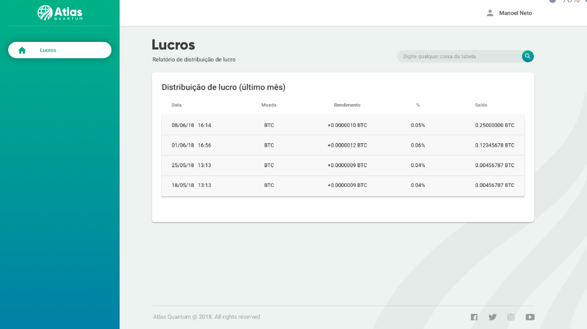

# Atlas Front Test - Lucros
[](https://travis-ci.org/raphaelbs/atlas-front-test)

Este é um projeto de teste para seleção. Basea-se nas tecnologias Angular 5, Typescript e Versionamento com git.

## Demo

Acesse o resultado final do projeto em:
> https://raphaelbs.github.io/atlas-front-test/

## Integrações

- Pipeline de CI e CD pelo [travis](travis-ci.org).
- Publicação no [GithubPages](https://pages.github.com/)

## O teste

O valor depositado pelo cliente na plataforma obteve lucro diário. O lucro foi estabelecido a partir do dia do depósito até a data corrente.

A tela prototipada possui as definições que o User Experience desenvolveu a melhor solução para a apresentação das informações ao cliente.

Observação do User Experience:

> O valor do rendimento é diário, cada linha da tabela corresponde a valorização em moeda BitCoin (BTC) e o percentual rendido. Na última coluna da tabela existirá o somatório do dia anterior com o saldo do dia corrente

## Referências

[Acesse o protótipo ](https://marvelapp.com/313a1ga/screen/44471533/handoff)


[Acesse o mock da API](http://www.mocky.io/v2/5b2c010d300000100023487a)
```json
[
  {
    "dateMoviment": "2018-11-07 21:51:03",
    "coin": "BTC",
    "proft": "0.668255",
    "profitPercentage": 38
  },
  {
    "dateMoviment": "2019-01-05 14:12:55",
    "coin": "BTC",
    "proft": "2.725550",
    "profitPercentage": 35
  },
]
```
